# Yandex Pay Kit — iOS Sample

Демонстрационное приложение для [YandexPaySDK](https://github.com/yandexmobile/yandex-pay-ios). Здесь собраны все основные продукты и модули SDK с примерами вызовов API на SwiftUI и UIKit.

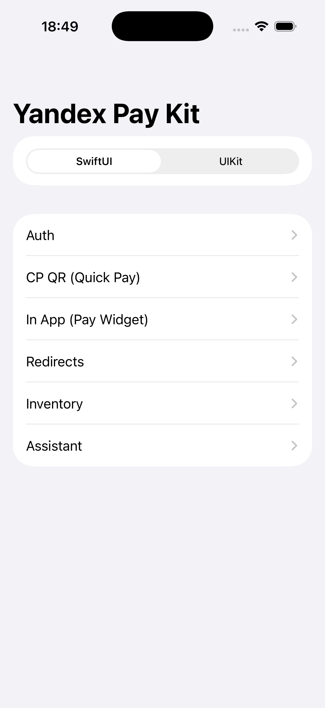{width=260px}

---

## Содержание

- [О SDK](#о-sdk)
- [Установка](#установка)
- [Создание заказа](#создание-заказа)
- [Модули](#модули)
  - [Auth — авторизация](#auth--авторизация)
  - [CP QR (Quick Pay) — QR-оплата](#cp-qr-quick-pay--qr-оплата)
  - [In App (Pay Widget) — встроенный виджет оплаты](#in-app-pay-widget--встроенный-виджет-оплаты)
  - [Redirects — оплата по URL](#redirects--оплата-по-url)
  - [Inventory — бейджи кешбэка и Сплита](#inventory--бейджи-кешбэка-и-сплита)
  - [Assistant — виджет выгоды](#assistant--виджет-выгоды)

---

## О SDK

**YandexPaySDK** — мобильный SDK для интеграции Яндекс Пэй в iOS-приложения.  
Репозиторий SDK: [github.com/yandexmobile/yandex-pay-ios](https://github.com/yandexmobile/yandex-pay-ios)

SDK разбит на независимые модули — подключайте только то, что нужно:

| Модуль | Пакет |
|---|---|
| Конфигурация | `YandexPayConfiguration` |
| Auth — авторизация | `YandexPayAuth` |
| CP QR (Quick Pay) | `YandexQuickPay` |
| Встроенный виджет оплаты | `YandexPayInApp` |
| Оплата по URL (Redirects) | `YandexPayWithRedirect` |
| Бейджи (Inventory) | `YandexPayInventory` |
| Виджет выгоды (Assistant) | `YandexPayAssistant` |

---

## Установка

Проект использует **Swift Package Manager**. Подробная инструкция по подключению SDK — в репозитории [yandex-pay-ios](https://github.com/yandexmobile/yandex-pay-ios).

> Подключайте только нужные модули — каждый пакет независим, `YandexPayConfiguration` подтянется транзитивно.

---

## Создание заказа

Модули **Redirects** и **In App (Pay Widget)** требуют сгенерированный URL оплаты. Демо приложение включает готовый экран **Order Settings** и слой создания заказа, которые можно использовать как справочную реализацию.

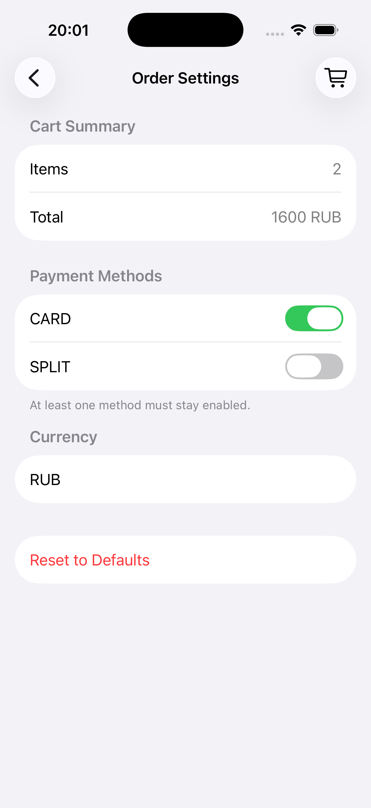{width=260px}

### Экран Order Settings

Доступен из главного экрана, а также из навигации внутри Redirects и Pay Widget. Позволяет настроить:

| Поле | Описание |
|---|---|
| **Cart Summary** | Сводка корзины: количество позиций и итоговая сумма |
| **Payment Methods** | Доступные методы оплаты: `CARD`, `SPLIT` (хотя бы один должен быть включён) |
| **Currency** | Код валюты (по умолчанию `RUB`) |
| **Кнопка корзины (🛒)** | Открывает редактор позиций: добавление, удаление, изменение `productId`, названия, суммы и количества |
| **Reset to Defaults** | Сброс корзины и настроек к начальным значениям |

### Архитектура создания заказа

```
OrderSettings          — хранит OrderConfiguration (корзина, валюта, методы)
      ↓
PaymentURLProvider     — запрашивает URL у API, хранит paymentURL / isLoading / errorMessage
      ↓
CreateOrderService     — POST /api/merchant/v1/orders
      ↓
paymentURL             → передаётся в кнопку оплаты и Pay Form
```

### Создание заказа через API

```swift
// Тело запроса формируется автоматически из OrderConfiguration
let url = try await CreateOrderService().createOrder(
    apiKey: apiKey, // используется тестовый ключ
    environment: .sandbox,
    flow: nil,           // nil или .sbpOnly
    order: orderConfiguration
)
```

Запрос отправляется на `POST https://sandbox.pay.yandex.ru/api/merchant/v1/orders`. Ответ содержит `data.paymentUrl` — готовую ссылку для открытия Pay Form или передачи в кнопку оплаты.

### Состав OrderConfiguration

```swift
struct OrderConfiguration {
    var cartItems: [CartItem]           // позиции корзины
    var currencyCode: String            // "RUB", "USD", …
    var availablePaymentMethods: [String] // ["CARD"], ["CARD", "SPLIT"]
    var ttlSeconds: Int                 // время жизни ссылки (0 = без ограничений)
    var redirectOnSuccess: String       // URL после успешной оплаты
    var redirectOnError: String         // URL при ошибке
    var redirectOnAbort: String         // URL при отмене оплаты
}

struct CartItem {
    var productId: String
    var title: String
    var total: String       // сумма позиции в виде строки, напр. "1000"
    var quantityCount: String
}
```

### Получение URL оплаты в своём коде

```swift
// PaymentURLProvider кэширует URL — повторный вызов не создаёт новый заказ
let url = await urlProvider.resolvePaymentURL()

// Принудительно создать новый заказ
let url = await urlProvider.generatePaymentURL()

// Сбросить кэш (например, после изменения корзины)
urlProvider.clearURL()
```

---

## Модули

Приложение поддерживает оба UI-фреймворка: переключатель **SwiftUI / UIKit** доступен прямо с главного экрана.

---

### Auth — авторизация

Модуль `YandexPayAuth` управляет авторизацией пользователя, сам модуль проксирует пакет [LoginSDK](https://github.com/yandexmobile/yandex-login-sdk-ios)  
Экран демонстрирует вход/выход и разные режимы авторизации (Default, Web Only, Primary Only).

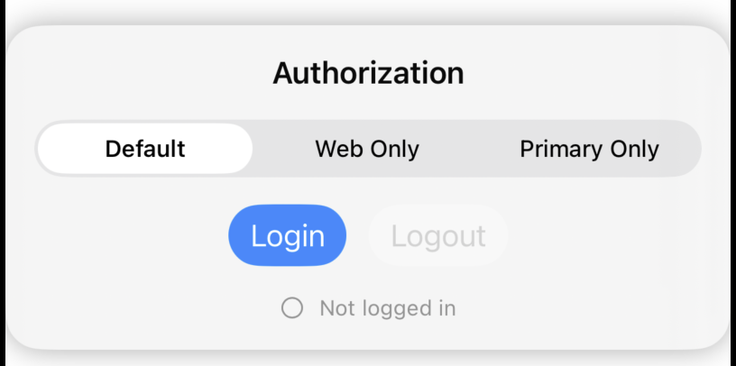{width=400px}

```swift
import YandexPayAuth

// Авторизация
YPay.instance.auth.login(from: presentingViewController, mode: .default) { result in
    switch result {
    case .success: print("авторизован")
    case .failure(let error): print(error)
    }
}

// Выход
YPay.instance.auth.logout()
```

---

### CP QR (Quick Pay) — QR-оплата

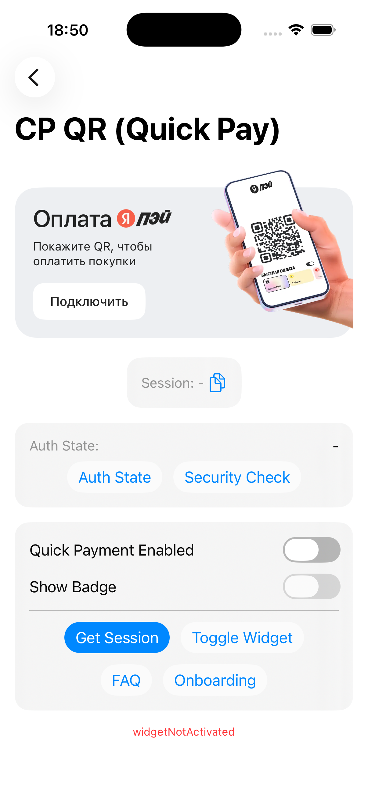{width=260px} 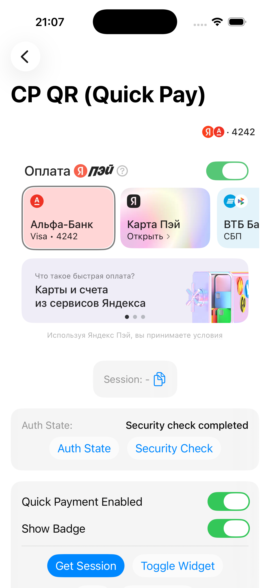{width=260px}

```swift
import YandexQuickPay

// Виджет со способами оплаты
let widget: UIView = YPay.instance.quickPay
    .createPaymentMethodsWidget(expandState: .collapsed)

// Бейдж активного способа оплаты
let badge: UIView = YPay.instance.quickPay.createActivePaymentMethodBadge()

// Получение сессии
let session = try await YPay.instance.quickPay.getSession()

// FAQ и онбординг
await YPay.instance.quickPay.showFaqScreen()
await YPay.instance.quickPay.showOnboardingStoriesScreen()
```

---

### In App (Pay Widget) — встроенный виджет оплаты

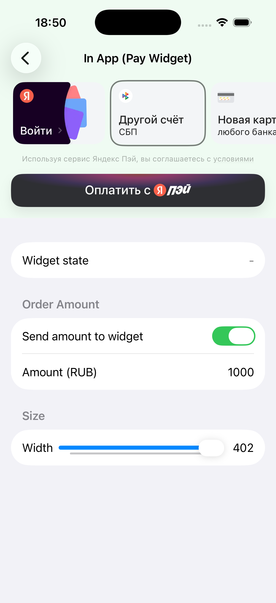{width=260px} 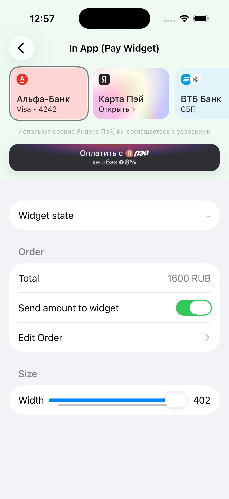{width=260px}

```swift
import YandexPayInApp

// Создание виджета (SwiftUI)
let widget: some View = YPay.instance.payInApp.createPayWidgetView(
    model: payWidgetModel,
    presentationContextProvider: self
)

// Создание виджета (UIKit)
let widgetView: UIView = YPay.instance.payInApp.createPayWidgetUIView(
    model: payWidgetModel,
    presentationContextProvider: self
)

// Подписка на изменения состояния виджета
YPay.instance.payInApp.setStateDelegate(self)
```

---

### Redirects — оплата по URL

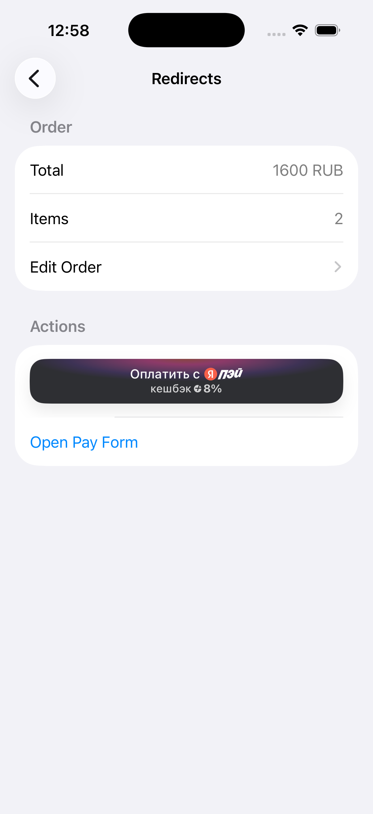{width=260px}

```swift
import YandexPayWithRedirect

// Кнопка оплаты
let button: YPButton = YPay.instance.payWithRedirect.createButton(
    model: .default,
    paymentDataProvider: self,   // предоставляет URL оплаты
    presentationContextProvider: self,
    delegate: self               // получает результат оплаты
)

// Открыть форму оплаты напрямую
YPay.instance.payWithRedirect.openPayForm(
    url: paymentURL,
    from: presentingViewController,
    delegate: self
)
```

---

### Inventory — бейджи кешбэка и Сплита

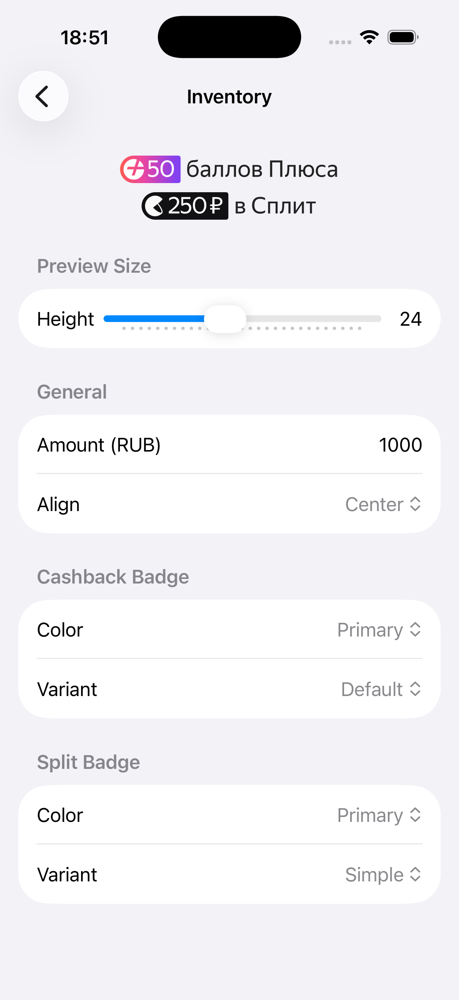{width=260px}

На экране можно настроить высоту, выравнивание, цветовую схему и вариант бейджа в реальном времени.

```swift
import YandexPayInventory

// Бейдж кешбэка
let cashbackModel = YPBadgeModel(
    amount: 1000,
    currency: .rub,
    align: .center,
    type: .cashback(color: .primary, variant: .default)
)
let cashbackBadge: UIView = YPay.instance.inventory.createBadgeView(model: cashbackModel)

// Бейдж Сплита
let splitModel = YPBadgeModel(
    amount: 1000,
    currency: .rub,
    align: .center,
    type: .split(color: .primary, variant: .simple)
)
let splitBadge: UIView = YPay.instance.inventory.createBadgeView(model: splitModel)
```

---

### Assistant — виджет выгоды

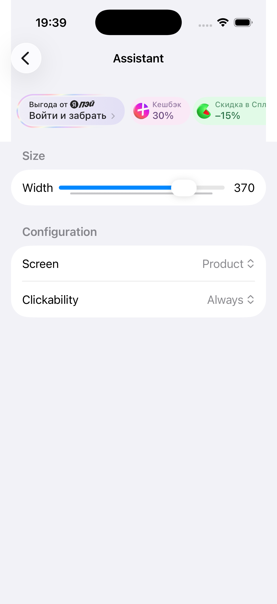{width=360px} 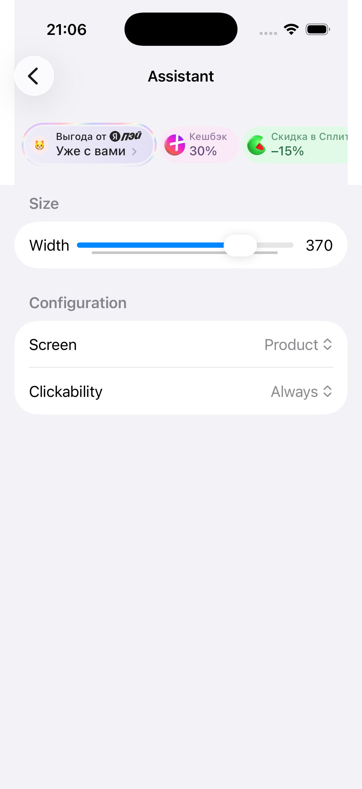{width=360px}

На экране можно задать ширину виджета, тип экрана (`product`, `cart`, `checkout`, …) и режим кликабельности.

```swift
import YandexPayAssistant

let benefitsWidget: UIView = YPay.instance.assistant.createBenefitsWidget(
    screen: .product,                              // контекст размещения
    presentationContextProvider: self,
    clickability: .always                          // или .onlyAuthorized
)
```

---
